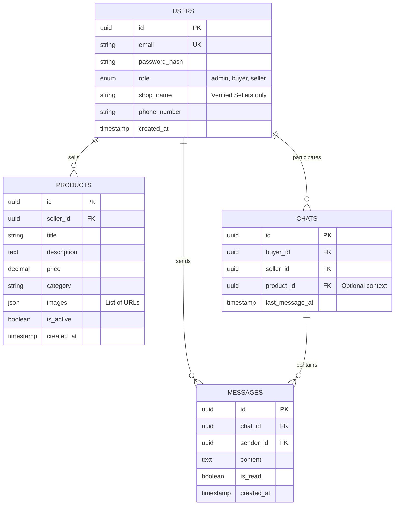

# Database Schema

This document outlines the core PostgreSQL schema for the marketplace platform.

## ER Diagram (Mermaid)

## Tables & Definitions

### 1. `users`
Centralized table for all roles.
- **id**: Primary Key, UUID.
- **email**: Unique, indexed.
- **role**: Enum ('admin', 'buyer', 'seller').
- **shop_details**: JSONB column (optional) to store seller-specific info (shop name, location) to keep the detailed schema clean, or separate `seller_profiles` table if complexity grows.

### 2. `products`
Items listed by sellers.
- **seller_id**: Foreign Key referencing `users(id)`.
- **price**: Application logic must handle currency (assume USD base).
- **images**: Array of strings (URLs) pointing to object storage.

### 3. `chats`
Represents a conversation thread between a buyer and a seller.
- **Indices**: Compound index on `(buyer_id, seller_id)` to prevent duplicate threads.
- **product_id**: Optional reference if the chat was started from a specific product context.

### 4. `messages`
Individual text exchanges within a chat.
- **Index**: Indexed by `chat_id` and `created_at` for efficient loading of history.

## Constraints & Integrity
- **Foreign Keys**: `ON DELETE CASCADE` or `SET NULL` strategies should be defined carefully.
    - *Example*: If a User is deleted, their Products should also be deleted (`CASCADE`).
- **Timestamps**: All tables include `created_at` (default `NOW()`) and `updated_at`.

## Future considerations (Phase 3+)
- **Reviews**: A `reviews` table linking `users` (buyer) to `products` or `users` (seller).
- **Ads**: An `advertisements` table for Admin-managed content.
